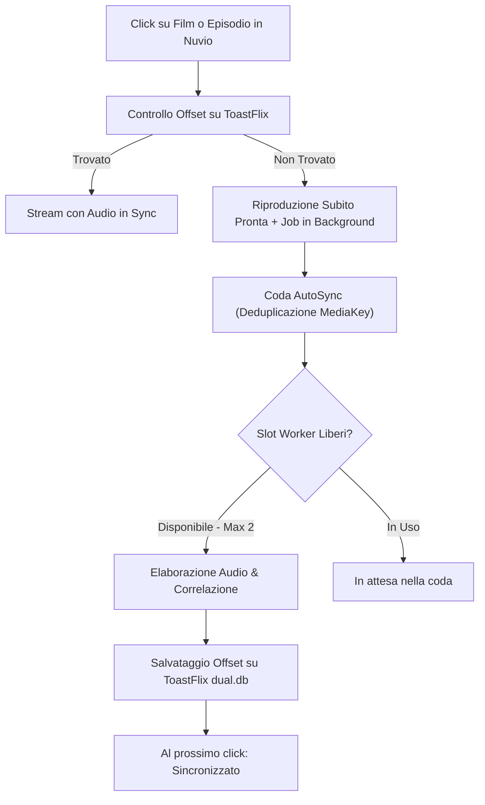

# PriSynx (MovyITA & DualSync)

Suite di plugin per **Nuvio** che combina video ad altissima definizione (4K / 1080p da Movy, Vidfast, Cinejoy) con audio italiano (StreamingCommunity / VX), assemblando al volo un master stream HLS multi-traccia (`data://application/m3u8/...`).

---

## 🎯 Audio Delay Automatico & Manuale

Molti video 4K/FHD e audio ITA provengono da edizioni diverse (es. loghi iniziali o sigle di durata differente). PriSynx include l'offset millimetrico per allinearli.

### 📺 NuvioTV (Android TV / Google TV)
I plugin includono nei metadati dello stream:
```javascript
behaviorHints: {
  audioDelayMs: 1250 // Ritardo in millisecondi (fino a ±60s)
}
```
* **Con la PR [#3781](https://github.com/NuvioMedia/NuvioTV/pull/3781)**: NuvioTV applica il ritardo **automaticamente all'avvio**, senza premere alcun tasto sul telecomando.
* **Funziona solo su NuvioTV**: ExoPlayer e mpv su Android TV supportano l'impostazione nativa del delay.

### 📱 Impostazione Manuale (Nuvio Mobile / Finché la PR è in review)
1. Nella lista stream, leggi il valore nel badge (es. `⏱️ +1,25 s`).
2. Avvia la riproduzione.
3. Apri le opzioni audio del player (icona ⚙️ / altoparlante).
4. Imposta manualmente il ritardo indicato.

---

## ⚙️ Come Funziona l'Auto-Misurazione



### Regole di Funzionamento:
* **Trigger al click**: la misurazione **non parte durante la ricerca** nel catalogo, ma solo al click sul singolo episodio (quando vengono risolti gli stream reali).
* **Nessuna attesa**: il video è visibile e riproducibile subito; il calcolo avviene asincrono in background.
* **Coda (Max 2 Worker contemporanei)**: per non sovraccaricare la CPU, AutoSync gestisce massimo 2 elaborazioni parallele. Eventuali altri titoli attendono in coda.
* **Deduplicazione**: richieste multiple dello stesso episodio incrementano le priorità senza duplicare i calcoli.
* **Retry intelligente**: se un titolo era incompatibile nel vecchio database ToastFlix (es. vecchio fastpass), il plugin lo reinvia ad AutoSync per verificarlo con precisione a traccia intera.

---

## 🏷️ Significato dei Badge

| Badge | Significato | Azione |
| :--- | :--- | :--- |
| `⏱️ +X,XX s` | **Offset misurato** | Su NuvioTV si applica da solo; su mobile imposta il valore a mano. |
| `🔊✅ in sync` | **In perfetto sincrono** | Nessun ritardo necessario (< 100 ms). |
| `⏳ da misurare` | **Primo avvio** | Puoi guardare il video subito; calcolo avviato in background. |
| `⏳ in coda` | **In coda** | Coda momentaneamente piena (2 worker attivi); calcolo a breve. |
| `⚙️ in calcolo` | **Calcolo in corso** | Analisi attiva in questo momento (richiede 60–90s). Riapri tra poco. |
| `⛔ versioni diverse` | **Incompatibile** | Montaggi differenti o tagli interni verificati da AutoSync. |

---

## 📦 Installazione

Aggiungi il manifest nella sezione **Plugin** di Nuvio:

```text
https://raw.githubusercontent.com/qwertyuiop8899/PriSynx/main/manifest.json
```
